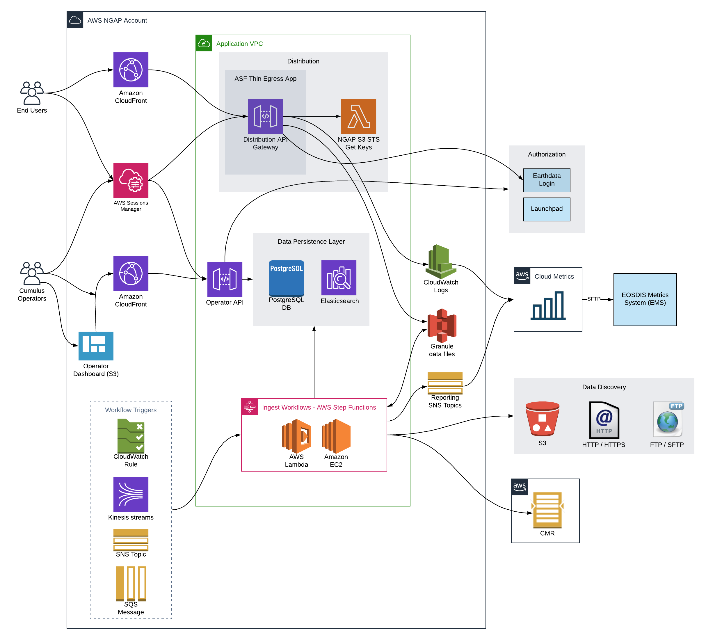

## Architecture

Below, find a diagram with the components that comprise an instance of Cumulus.

This diagram details all of the major architectural  components of a Cumulus deployment.

While the diagram can feel complex, it can easily be digested in several major components:

### Data Distribution

End Users can access data via Cumulus's `distribution` submodule, which includes ASF's [thin egress application](https://github.com/asfadmin/thin-egress-app), this provides authenticated data egress, temporary S3 links and other statistics features.

#### Data search

End user exposure of Cumulus's holdings is expected to be provided by an external service.

For NASA use, this is assumed to be [CMR](<https://earthdata.nasa.gov/eosdis/science-system-description/eosdis-components/cmr>) in this diagram.

### Data ingest

#### Workflows

The core of the ingest and processing capabilities in Cumulus is built into the deployed AWS [Step Function](https://aws.amazon.com/step-functions/) workflows.    Cumulus rules trigger workflows via either Cloud Watch rules, Kinesis streams, SNS topic, or SQS queue.   The workflows then run with a configured [Cumulus message](./workflows/cumulus-task-message-flow), utilizing built-in processes to report status of granules, PDRs, executions, etc to the [Data Persistence](#data-persistence) components.

Workflows can optionally report granule metadata to [CMR](<https://earthdata.nasa.gov/eosdis/science-system-description/eosdis-components/cmr>), and workflow steps can report metrics information to a shared SNS topic, which could be subscribed to for near real time granule, execution, and PDR status. This could be used for metrics reporting using an external ELK stack, for example.

#### Data persistence

Cumulus entity state data is stored in a [PostgreSQL](https://www.postgresql.org/) compatible database, and is exported to an Elasticsearch instance for non-authoritative querying/state data for the API and other applications that require more complex queries. 

#### Data discovery

Discovering data for ingest is handled via workflow step components using Cumulus `provider` and `collection` configurations and various triggers.    Data can be ingested from AWS S3, FTP, HTTPS and more.

#### Database

Cumulus utilizes a user-provided PostgreSQL database backend. For improved API search query efficiency Cumulus provides data replication to an Elasticsearch instance.

##### PostgreSQL Database Schema Diagram

### Maintenance

System maintenance personnel have access to manage ingest and various portions of Cumulus via an [AWS API gateway](<https://aws.amazon.com/api-gateway/>), as well as the operator [dashboard](https://github.com/nasa/cumulus-dashboard).

## Deployment Structure

Cumulus is deployed via [Terraform](https://www.terraform.io/) and is organized internally into two separate top-level modules, as well as several external modules.

### Cumulus

The [Cumulus module](https://github.com/nasa/cumulus/tree/master/tf-modules/cumulus), which contains multiple internal submodules, deploys all of the Cumulus components that are not part of the `Data Persistence` portion of this diagram.

### Data persistence

The [data persistence](https://github.com/nasa/cumulus/tree/master/tf-modules/data-persistence) module provides the `Data Persistence` portion of the diagram.

### Other modules

Other modules are provided as artifacts on the [release](https://github.com/nasa/cumulus/releases) page for use in users configuring their own deployment and contain extracted subcomponents of the [cumulus](#cumulus) module.  For more on these components see the [components documentation](deployment/components).

For more on the specific structure, examples of use and how to deploy and more, please see the [deployment](deployment) docs as well as the [cumulus-template-deploy](https://github.com/nasa/cumulus-template-deploy) repo
.
